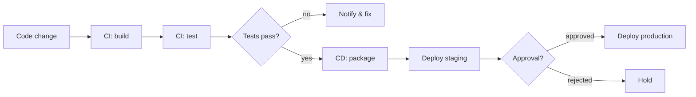
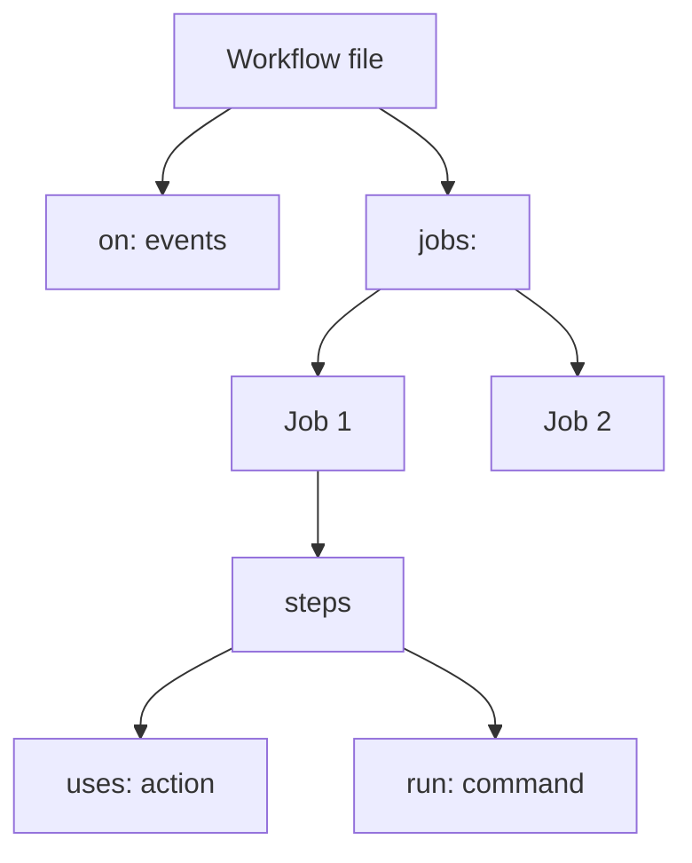
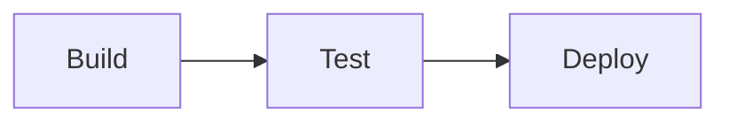
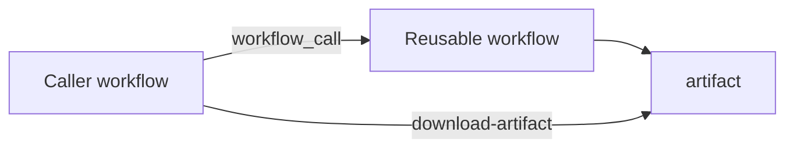
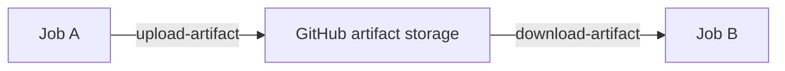
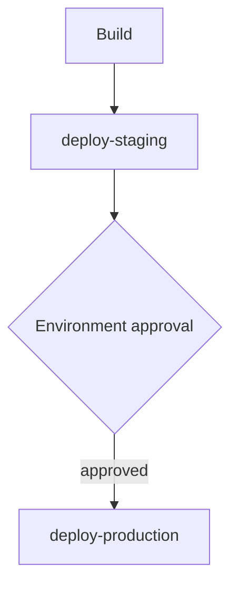
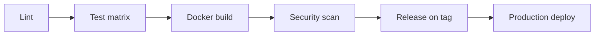
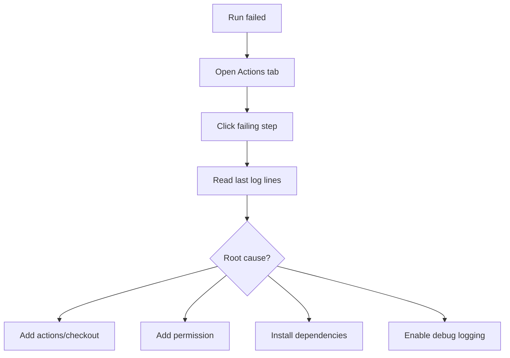

# Diagrams

GitHub-friendly Mermaid diagrams. These render on GitHub directly.

## CI/CD lifecycle

## Workflow structure

## Job dependencies (needs)

## Reusable workflow call

## Artifact flow

## Deployment approval flow

## Final CI/CD pipeline

## Debugging decision tree

